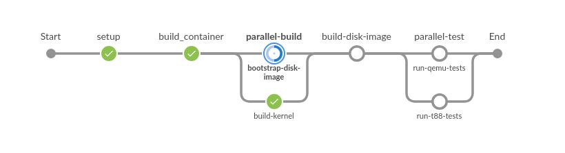
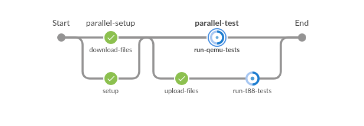

# The TDD project

A framework for test driven Linux software development.

## Jenkins Support

For setup see the TDD Jenkins service [README](docker/jenkins/README.md).

### Jenkins Kernel Tests:



### Jenkins Distribution Tests:



## tftpd service

The tdd-tftpd service is used in conjunction with a tdd-ipxe image installed
on remote machines to provide an automated boot mechanism of remote machines
controlled via Intelligent Platform Management Interface (IPMI) commands.

For setup see the TDD tftpd service [README](docker/tftpd/README.md).

## ipxe Support

Remote machines have a custom [ipxe bootloader](https://ipxe.org) image
installed. This custom image knows where the tdd-tftpd server is located and
what files from the server are to be booted on that system.  The system's
UEFI is then configured to run this custom ipxe bootloader image on boot.

For setup see the TDD ipxe [README](https://github.com/glevand/tdd--ipxe/blob/master/README).

Use commands like to these to build and install:

```sh
cd src
make V=1 CROSS_COMPILE=aarch64-linux-gnu- ARCH=arm64 EMBED=tdd-boot-script -j $(getconf _NPROCESSORS_ONLN || echo 1) bin-arm64-efi/snp.efi
scp bin-arm64-efi/snp.efi root@${remote}:/boot/efi/EFI/ipxe-tdd.efi
ssh ${tftpd_server} mkdir -p /var/tftproot/${remote}/
```

## relay service

Once a remote machine has booted it needs to let the master know it is and ready 
to receive commands, and if the remote machine was configured via DHCP it must 
provide its IP address to the master.  The tdd-relay server is at a known 
network location and acts as a message relay server from the remote machine to 
the master.  If there is a firewall between the master and any remote machines 
the relay service must accessible from outside the firewall.

For setup see the TDD relay service [README](docker/relay/README.md).

## Build Host Setup

### Host System binfmt support

QEMU user mode emulation is used when cross building root filesystems.  QEMU
user mode binfmt support needs to be setup on the build host.

#### Debian based systems

For Debian based systems the following packages will install the needed binfmt
support:

```sh
sudo apt-get install binfmt-support qemu-user-static
sudo systemctl restart systemd-binfmt.service
```
#### Fedora based systems

For Fedora based systems the following packages will install the needed binfmt
support:

```sh
sudo qemu-user qemu-user-binfmt
sudo systemctl restart systemd-binfmt.service
```
#### Other systemd based systems

```sh
echo ':qemu-aarch64:M::\x7fELF\x02\x01\x01\x00\x00\x00\x00\x00\x00\x00\x00\x00\x02\x00\xb7:\xff\xff\xff\xff\xff\xff\xff\x00\xff\xff\xff\xff\xff\xff\xff\xff\xfe\xff\xff:/usr/bin/qemu-aarch64-static:' | sudo tee /etc/binfmt.d/qemu-aarch64.conf > /dev/null
sudo systemctl restart systemd-binfmt.service
```

#### To test binfmt installation:

```sh
$ ls /proc/sys/fs/binfmt_misc
qemu-aarch64  register  status
```

### Container and Service Setup

The [docker-build-all.sh](docker/docker-build-all.sh) script will bulid all the 
TDD containers and can also install and enable the systemd services of those 
containers that have them.  Individual containers and services can be build 
and/or setup with the container's build script, 
[build-jenkins.sh](docker/jenkins/build-jenkins.sh) for example.

## Trouble-shooting

Seen: `Got permission denied while trying to connect to the Docker daemon socket`

Seen: `/var/run/docker.sock: permission denied`

Solution: Add current user to docker group.

***

Seen: `chroot: failed to run command ‘/bin/bash’: Exec format error`

Solution: Install [host binfmt support](https://github.com/glevand/tdd-project#host-system-binfmt-support).
